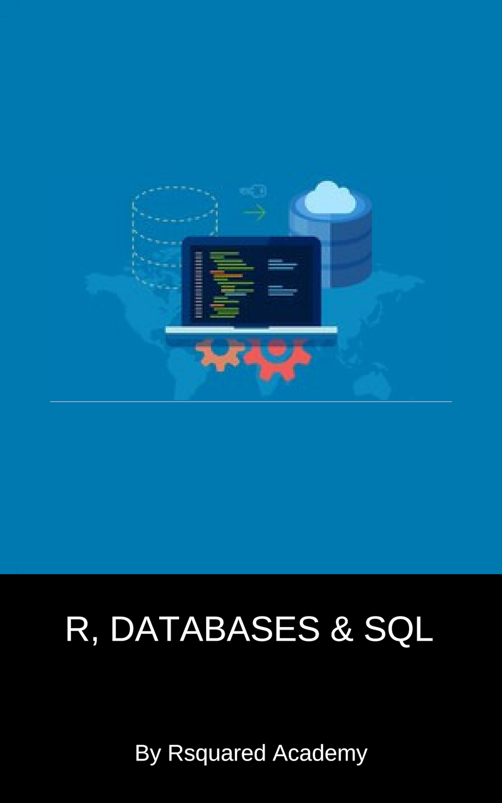

# R, Databases & SQL



*R4DS Ch. 21 in 30 minutes leaves beginners behind. This book is the 2-hour ramp before it — DBI mechanics + first 20 SQL verbs, all runnable with zero setup.*

📖 **Read the book:** https://rdbsql.rsquaredacademy.com

[](https://posit.cloud/content/430439)
[](https://codespaces.new/rsquaredacademy-education/rdbsql)

## Syllabus

| # | Chapter | You will learn |
|:--|:--------|:---------------|
| 1 | DBI | `dbConnect`, `dbListTables`, `dbReadTable`, `dbGetQuery`, `dbSendQuery`/`dbFetch`, `dbWriteTable`, `dbExecute`, `dbDisconnect` |
| 2 | dbplyr | `tbl()`, `filter`, `select`, `group_by`+`summarise`, `show_query`, `explain`, `collect` + lazy evaluation |
| 3 | SQL Basics | `SELECT`, `LIMIT`, `DISTINCT`, `WHERE`, `AND`/`OR`/`NOT`, `BETWEEN`, `IN`, `IS NULL`, `LIKE` |
| 4 | SQL Advanced | `SUM`/`AVG`/`MIN`/`MAX`, `AS` aliases, `ORDER BY`, `GROUP BY` |
| 5 | JOINs | `INNER JOIN`, `LEFT JOIN`, SQLite `RIGHT`/`FULL` trap, `inner_join`/`left_join`/`semi_join`/`anti_join` |
| A | DBI Cheat Sheet | One-page command reference (CC BY-NC-SA 4.0) |
| B | Production R Patterns | Connection strings, credentials, parameterized queries, transactions, `pool` |
| C | DuckDB + Parquet | Same DBI code at analytical speed, query files without loading them |

Each chapter ends with 3 hands-on exercises. Worked solutions live in [`solutions/`](solutions/) (one file per chapter, kept out of the rendered book so you can attempt first). Runnable scripts live in [`code/`](code/) (run from the repo root, offline-safe via `data/ecom.sqlite`).

## Zero-setup environments

- **Tier 0 (primary):** Posit Cloud project — 1-click RStudio in the browser (link above; clone this repo via New Project → From Git URL).
- **Alternative:** GitHub Codespaces — click the badge above; the `.devcontainer` boots R 4.4.2 + Quarto + packages automatically.
- **Local:** R (4.4+) + RSQLite + Quarto CLI 1.10.18+. See Chapter 1's DuckDB note for the analytical twin.

## Develop

```bash
quarto preview                     # live HTML preview
quarto render                      # full book (HTML + Typst PDF + ePub into docs/)
Rscript scripts/verify.R           # run all code/*.R as regression check
```

CI renders HTML, Typst PDF, and ePub and deploys `docs/` via GitHub Pages. `master` is the production branch.

## License

CC BY-NC-SA 4.0.
